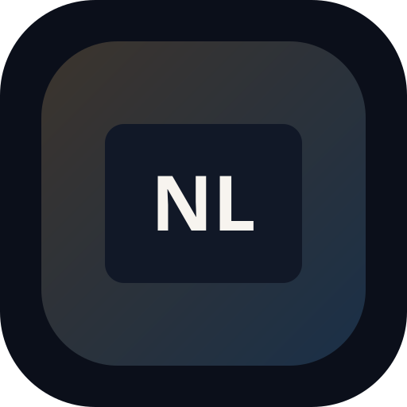

# Nong LiMing



> **Your friendly Thai learning companion** 🇹🇭

Nong LiMing helps you learn Thai in short, focused sessions. It uses familiar sounds to guide pronunciation and simple sentence structure to build confidence, so even 15 minutes can feel productive.

## ✨ Features

- **Flashcards**: Review words with smart scheduling. `[In Development]`
- **Offline Ready**: Learn anywhere, even without a connection. `[Ready]`
- **Consonant Grid**: Thai consonants mapped to Hindi/Sanskrit equivalents. `[Planned]`
- **Sentence Builder**: Practice building real sentences. `[Planned]`

## 🛠️ Tech Stack

- **Framework**: [React](https://react.dev/) + [TypeScript](https://www.typescriptlang.org/)
- **Styling**: [Tailwind CSS](https://tailwindcss.com/) + [Framer Motion](https://www.framer.com/motion/)
- **Database**: [Dexie.js](https://dexie.org/)
- **PWA**: [Vite PWA](https://vite-pwa-org.netlify.app/)
- **Icons**: [Lucide](https://lucide.dev/)
- **Font**: [Sarabun](https://fonts.google.com/specimen/Sarabun)

## 🚀 Getting Started

### Prerequisites

- [Node.js](https://nodejs.org/) (Latest LTS)
- [pnpm](https://pnpm.io/)

### Installation

```bash
# Clone the repository
git clone https://github.com/rahidmondal/nong-liming.git

# Navigate to project directory
cd nong-liming

# Install dependencies
pnpm install

# Start development server
pnpm dev
```

### Available Scripts

- `pnpm dev`: Start the development server.
- `pnpm build`: Build the application for production.
- `pnpm preview`: Locally preview the production build.
- `pnpm lint`: Run ESLint to check code quality.
- `pnpm format`: Format code using Prettier.

## 📂 Architecture

```text
src/
├── components/   # Shared UI components
├── data/         # Static data (consonants, vocabulary)
├── features/     # Feature-based modules (landing, decks, etc.)
├── hooks/        # Custom React hooks
├── lib/          # Utility libraries and configurations
├── store/        # Zustand state stores
└── types/        # TypeScript type definitions
```

## 📄 License

Copyright © 2026 Rahid Mondal. All rights reserved.
License details will be updated upon official release.
