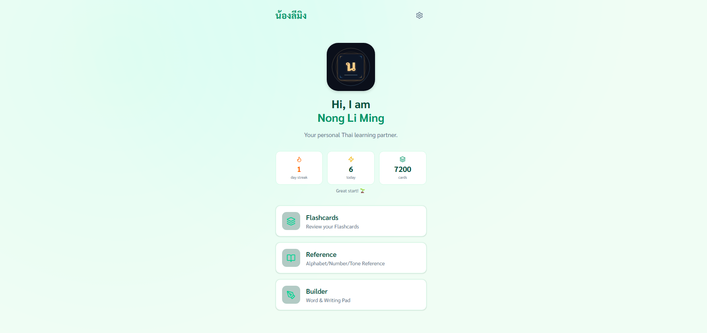
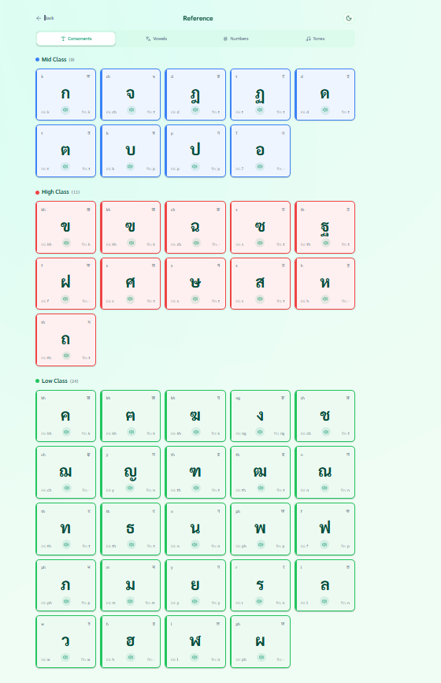
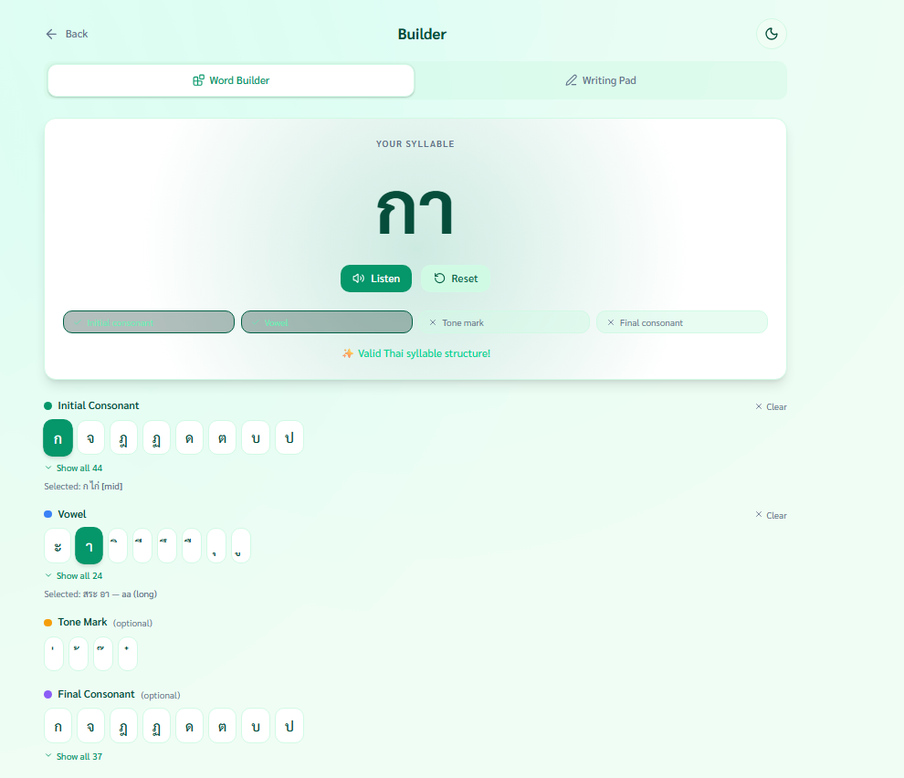
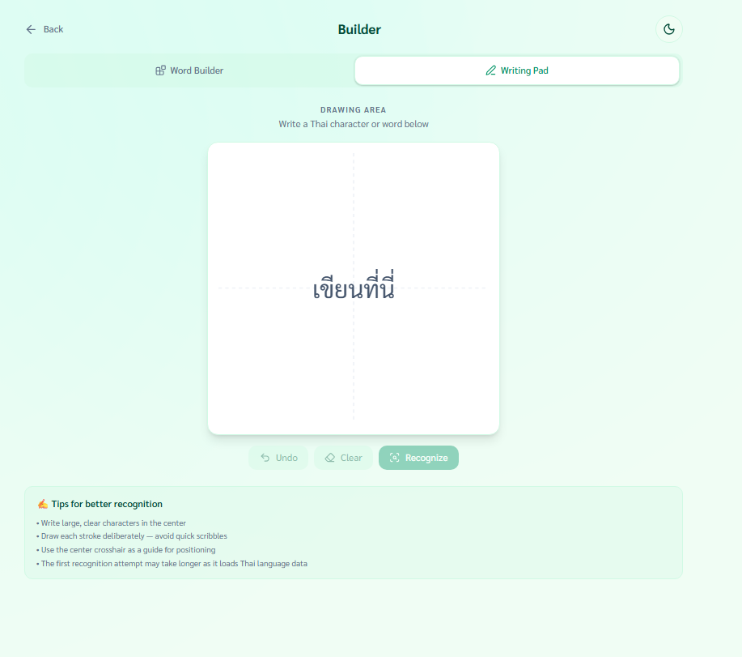
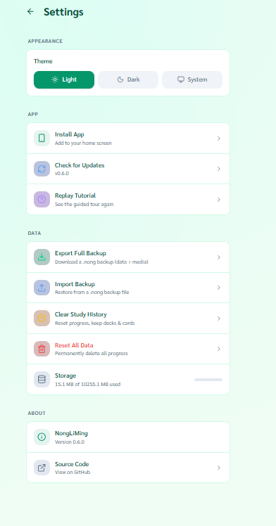
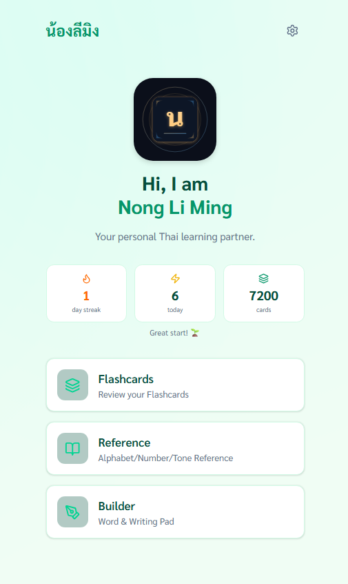

<div align="center">


# Nong LiMing — น้องลีมิง

[](https://github.com/rahidmondal/nong-liming)
[](LICENSE)
[]()

**Your friendly Thai learning companion** 🇹🇭

Learn Thai in short, focused sessions. Nong LiMing uses familiar sounds to guide pronunciation
and simple structure to build confidence — even 15 minutes can feel productive.

<br/>



</div>

---

## Features

### 📖 Reference Guide

A comprehensive, interactive guide to the Thai writing system.

| Feature            | Details                                                                                                |
| ------------------ | ------------------------------------------------------------------------------------------------------ |
| **Consonants**     | All 44 consonants grouped by class (Mid, High, Low) with color-coded cards and Indic/Hindi equivalents |
| **Vowels**         | 32 vowels — Monophthongs, Diphthongs, and Special vowels                                               |
| **Numbers**        | Thai numerals from 0 to Billion with pronunciation guides                                              |
| **Tones**          | SVG tone-contour diagrams for all 5 tones with audio samples                                           |
| **Text-to-Speech** | Native browser TTS for instant pronunciation of any character or word                                  |

<details>
<summary>📸 Screenshot</summary>
<br/>

</details>

---

### 🃏 Flashcards & Spaced Repetition

Review vocabulary with an SM-2 spaced repetition scheduler and full Anki import support.

- **Deck Management** — Create, rename, and delete decks; add cards manually with front/back text
- **Anki Import** — Import `.apkg` files with multi-step preview (deck names, note counts, note types) and background processing with progress toasts
- **Sample Decks** — One-click load of bundled decks: _Thai 1000 Common Words_ and _Thai Read, Hear & Translate_
- **Smart Study Sessions** — Configurable daily limits for new and review cards; sessions persist across app restarts
- **4-Button Rating** — Again / Hard / Good / Easy with interval previews showing next review time
- **Keyboard Shortcuts** — `Space`/`Enter` to reveal, `1`/`2`/`3`/`4` to rate
- **Session Summary** — Cards reviewed, accuracy %, session time, new vs. review breakdown, with confetti celebration 🎉

---

### 🏗️ Word Builder

Construct valid Thai syllables with a guided, slot-based interface.

- **Structure Validation** — Real-time feedback on syllable structure (Initial Consonant + Vowel required)
- **Slot System** — Dedicated slots for Initial Consonant, Vowel, Tone Mark, and Final Consonant
- **Smart Filtering** — Shows only valid characters for each slot with visual grouping
- **Pronunciation** — Listen to the constructed syllable with TTS

<details>
<summary>📸 Screenshot</summary>
<br/>

</details>

---

### ✍️ Writing Pad

Practice Thai handwriting with AI-powered recognition and instant feedback.

- **AI OCR** — Tesseract.js (LSTM engine) recognizes handwritten Thai characters
- **Canvas Interface** — Smooth drawing with pressure-sensitivity mimicry, grid overlay, and undo/erase
- **Confidence Scoring** — Visual indicator of recognition confidence
- **Speech Synthesis** — Hear the recognized text pronounced immediately

<details>
<summary>📸 Screenshot</summary>
<br/>

</details>

---

### 📊 Statistics

Track your learning progress with detailed analytics.

- **Overview Cards** — Total cards, total reviews, current streak (days), reviews today
- **Card Status Breakdown** — Progress bars for New, Learning, and Review cards
- **Activity Heatmap** — 30-day bar chart of daily review activity with hover tooltips
- **Per-Deck Stats** — Card counts, average ease factor, and completion progress

---

### ⚙️ Settings

Fine-tune your experience and manage your data.

- **Theme** — Light / Dark / System
- **PWA Install** — Add to Home Screen prompt; shows standalone status when installed
- **Updates** — Manual service worker update check with version display
- **Guided Tutorial** — Replay the first-time walkthrough (powered by Driver.js)
- **Backup & Restore** — Export/import full backups as `.nong` files (data + media)
- **Clear Study History** — Reset progress while keeping decks and cards
- **Reset All Data** — Wipe everything from IndexedDB
- **Storage Usage** — Visual indicator of used vs. available quota

<details>
<summary>📸 Screenshot</summary>
<br/>

</details>

---

### 📱 Progressive Web App

Install and use Nong LiMing like a native app.

- **Offline Ready** — Full offline support via service worker
- **Installable** — Add to Home Screen on mobile and desktop
- **Auto Updates** — Dismissible update banner when a new version is available
- **Local Storage** — All data stored in IndexedDB; nothing leaves your device

<div align="center">

</div>

---

## Tech Stack

| Layer      | Technology                                                                                           |
| ---------- | ---------------------------------------------------------------------------------------------------- |
| Framework  | [React 19](https://react.dev/) + [TypeScript](https://www.typescriptlang.org/)                       |
| Build      | [Vite (Rolldown)](https://vite.dev/)                                                                 |
| Styling    | [Tailwind CSS 4](https://tailwindcss.com/) + [Framer Motion](https://www.framer.com/motion/)         |
| Database   | [Dexie.js](https://dexie.org/) (IndexedDB)                                                           |
| OCR        | [Tesseract.js](https://tesseract.projectnaptha.com/)                                                 |
| PWA        | [Vite PWA](https://vite-pwa-org.netlify.app/) + [Workbox](https://developer.chrome.com/docs/workbox) |
| Onboarding | [Driver.js](https://driverjs.com/)                                                                   |
| Icons      | [Lucide](https://lucide.dev/)                                                                        |
| Font       | [Sarabun](https://fonts.google.com/specimen/Sarabun)                                                 |
| Testing    | [Vitest](https://vitest.dev/) + [Testing Library](https://testing-library.com/)                      |

---

## Getting Started

### Prerequisites

- [Node.js](https://nodejs.org/) (Latest LTS)
- [pnpm](https://pnpm.io/)

### Installation

```bash
# Clone the repository
git clone https://github.com/rahidmondal/nong-liming.git
cd nong-liming

# Install dependencies
pnpm install

# Start development server
pnpm dev
```

### Scripts

| Command              | Description                      |
| -------------------- | -------------------------------- |
| `pnpm dev`           | Start development server         |
| `pnpm build`         | Production build                 |
| `pnpm preview`       | Preview production build locally |
| `pnpm lint`          | Run ESLint                       |
| `pnpm format`        | Format with Prettier             |
| `pnpm test`          | Run tests once                   |
| `pnpm test:watch`    | Run tests in watch mode          |
| `pnpm test:coverage` | Run tests with coverage report   |

---

## License

Licensed under the MIT License. See [LICENSE](LICENSE).
